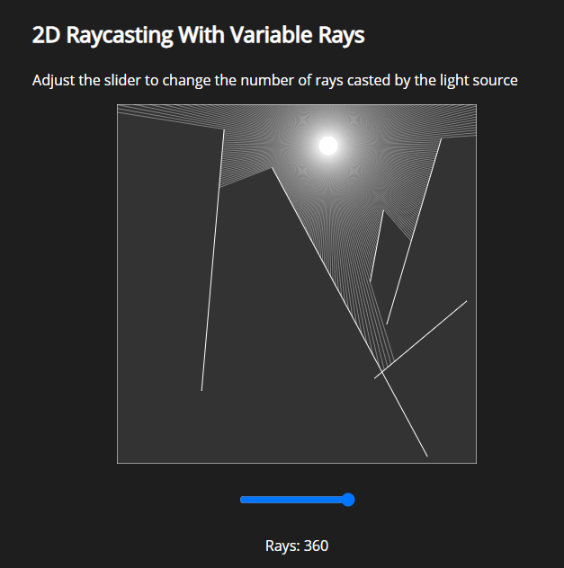
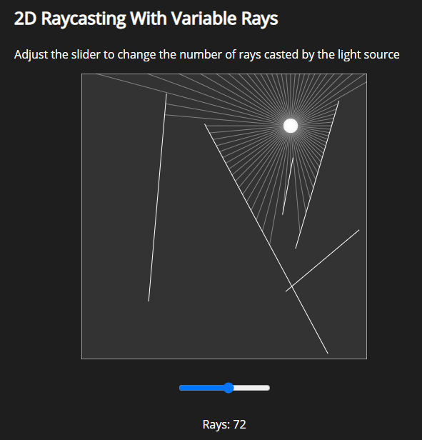

# Raycasting

### Attribution

The core functionality of the program in this repository comes from
"Coding Challenge #145: 2D Raycasting" by Daniel Shiffman. 

I've followed his tutorial as a learning experience and added some of my own functionality.

### Project Description
This project uses p5.js to simulate simple 2D raycasting. The light source can be moved around
by simply moving the mouse around in the canvas.

I've added a range slider to change the number of rays casted from the light source

